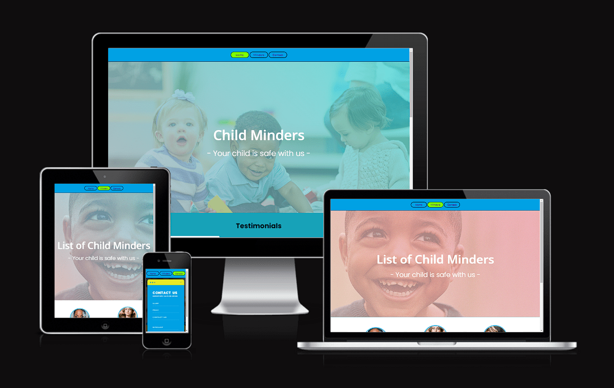
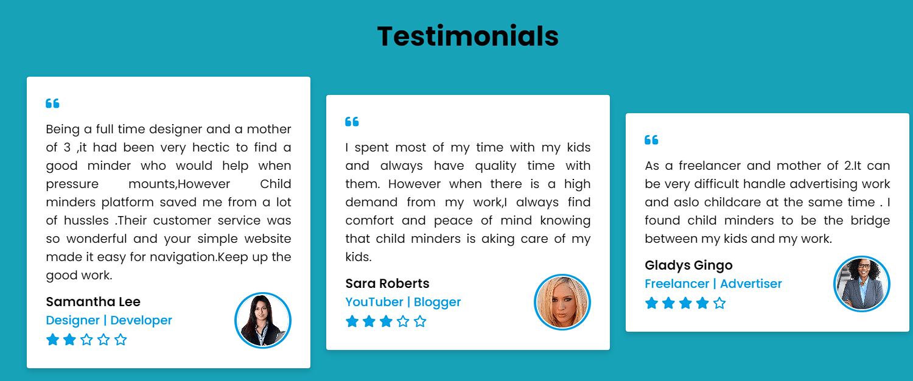
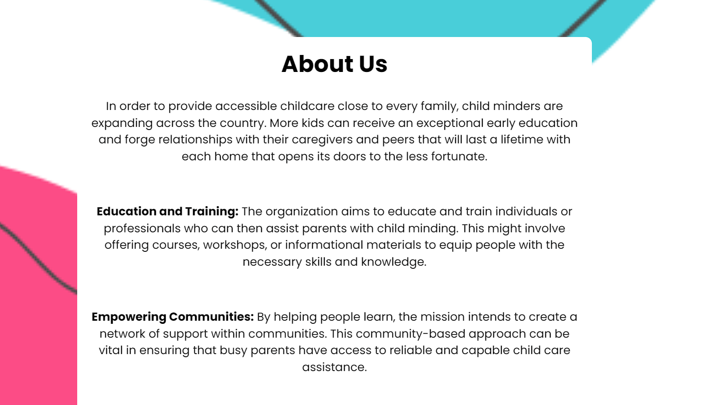
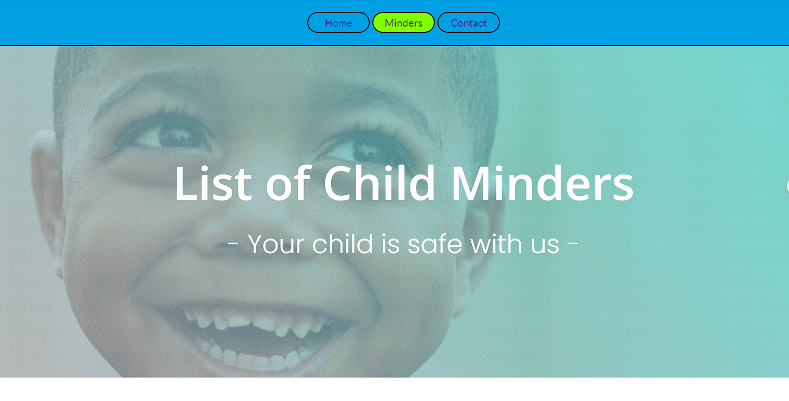
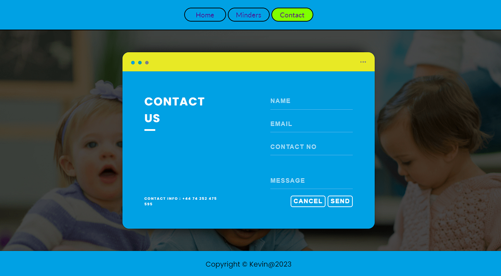
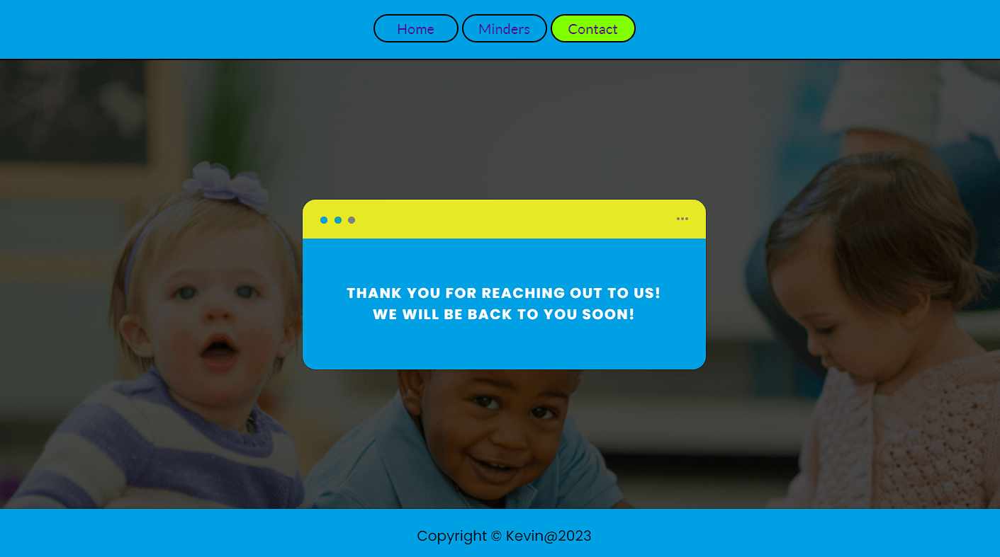
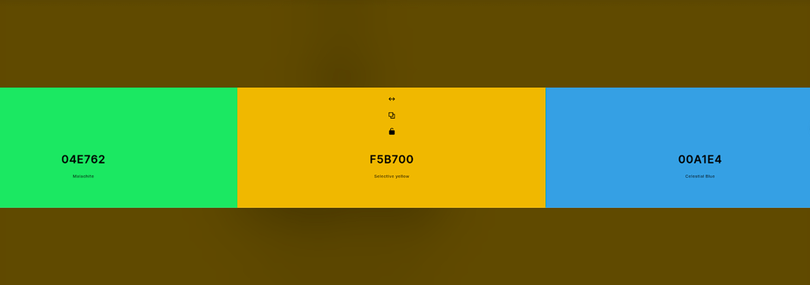

---

# *Child Minders*

The Child Minders website allows people to learn about the company "Child Minders" and find information to link children and their potential minders in their area . The visitors of the website could quickly contact the company about child care services.

The site can be accessed by this [link](https://tkodimac.github.io/child-minder/)

---
## User Stories

### First Time Visitor Goals:

* As a First Time Visitor, I want to easily understand the main purpose of the site, so I can learn more about the organization.
* As a First Time Visitor, I want to be able to easily navigate through the website, so I can find the content.
* As a First Time Visitor, I want to see the testimonials, so I can see whether the organization is trustworthy.

### Returning Visitor Goals:

* As a Returning Visitor, I want to see various child minders, so that I can pick from.
* As a Returning Visitor, I want to see information about satisfied parents, so that I can choose a preffered minder according to the rating.
* As a Returning Visitor, I want to find a way to get in contact with the organization, so that I can ask additional questions or send a request about a particular child minder.
* As a Returning Visitor, I want to find community links, so that I can learn more about the organization.

### Frequent Visitor Goals:
* As a Frequent User, I want to check whether there are any changes with available child minder, so I can make a choice which child minder to select. 

## Features

+ ### Navbar

+ ##### Navigation
    - Positioned at the top of the page.
    - Contains navigation links on the right side:
        * HOME - leads to the home page where users can learn about the company Child Minders.
        * CHILD MINDERS - leads to the minders page where users can see available childcare  in the Child Minders.
        * CONTACT - leads to the contact form page where users can fill out the form in order to get in touch with the company.
    - The navigation is clear and easy to understand for the user.
    

    - The navigation bar is responsive:
        * On tablets , mobile and computers: navigation bar is clear and visible and elements are centered.
        
        
---

+ ### Home Page

    - Represent: 

        * the main idea of the company.
        * Emphasize the strong points of the company.
        * Shows feedback from satisfied clients.
        * the mission goal of the company

---

+ #### Hero Section

    - Hero section is on two separate web pages(home page and minders page)
      
    - Hero section have a fixed background image on both the home page and minders page.

    - Hero section have the block section below on image that consist:

        * The web page description
        * Short description of the company's philosophy.
         
  
--- 

+ #### Testimonials Section

    - Testimonials Section has three feedbacks from people who were satisfied with the company's service.

    - Each card has a picture of the client.

    - Each card has a story from the people who had an experience using the Child Minders.

    - Each card has a name of the client.

​
    

---
+ #### About Us Section

    - Tells website visitors about the company and its objectives.

    - Attracts viewers to use this company for child minding.
 
    - Contains social media links that open in a new tab.

    
    

    ---
+ #### Footer

    - Footer contains copyright of the website.
​
    
​
---
+ ### Minders Page

    - Minders page has a hero image and an introduction message for the visitors of the company.
 
    - Childminder Section has three introduction messages from childminders who are using the company's service.

    - It has a button right after the introduction message of each child minder that leads to the contact form page.

    - It has photos of each child minders that a present in the Child Minders in real-time.
      
     - It has a footer identical to the home page's footer.
    
​
    

---
+ ### Contact page

    - Contact page has a contact form:

        - All text input fields are customized.
        - Requests that you fill out the contact form.
        - All inputs are set to be required to fill out.
        - The submit button is animated on hover.

    - The page is responsive on all common screen sizes.

    - The submit button leads to the response page.
​
    

---
+ ### Response page

    - Response page appears after submitting the contact form.
    - It contains the thank you message and the promise to get in touch with the applicant.

    

---
## Technologies Used

- [HTML](https://developer.mozilla.org/en-US/docs/Web/HTML) was used as the foundation of the site.
- [CSS](https://developer.mozilla.org/en-US/docs/Web/css) - was used to add the styles and layout of the site.
- [CSS Flexbox](https://developer.mozilla.org/en-US/docs/Learn/CSS/CSS_layout/Flexbox) - was used to arrange items simmetrically on the pages.
- [CSS Grid](https://developer.mozilla.org/en-US/docs/Web/CSS/grid) - was used to make "gallery" and "contact" pages responsive.
- [CSS roots](https://developer.mozilla.org/en-US/docs/Web/CSS/:root) was used to declaring global CSS variables and apply them throughout the project. 
- [Balsamiq](https://balsamiq.com/) was used to make wireframes for the website.
- [Codeanywhere](https://app.codeanywhere.com/) was used as the main tool to write and edit code.
- [Git](https://git-scm.com/) was used for the version control of the website.
- [GitHub](https://github.com/) was used to host the code of the website.
- [GIMP](https://www.gimp.org/) was used to make and resize images for the README file.

---
## Design

### Color Scheme

- Celestial Blue color was used as the main color of the website due to its phycological effect on people's minds.
  
- Celestial Blue Color was used as a background color since this color creates a child friendly feel.

- Malachite color was used to make an emphasis on the logo and leave a memorable effect on the website visitors.

- Selective Yellow Color was used as a background color since this color creates a child friendly feel.

#### Mobile devices

- [Home Page. Mobile Screen](documentation/mobile_home_page.png)
- [Gallery Page. Mobile Screen](documentation/mobile_gallery_page.png)
- [Contact Page. Mobile Screen](documentation/mobile_contact_form_page.png)
- [Response Page. Mobile Screen](documentation/mobile_response_page.png)

#### Tablets

- [Home Page. Tablet Screen](documentation/tablet_home_page.png)
- [Gallery Page. Tablet Screen](documentation/tablet_gallery_page.png)
- [Contact Page. Tablet Screen](documentation/tablet_contact_form_page.png)
- [Response Page. Tablet Screen](documentation/tablet_response_page.png)

#### Desktop

- [Home Page. Desktop Screen](documentation/desktop_home_page.png)
- [Gallery Page. Desktop Screen](documentation/desktop_gallery_page.png)
- [Contact Page. Desktop Screen](documentation/desktop_contact_form_page.png)
- [Response Page. Desktop Screen](documentation/desktop_response_page.png)

---

## Testing

Please refer to the [TESTING.md](TESTING.md) file for all test-related documentation.

---

## Deployment

### Deployment to GitHub Pages

- The site was deployed to GitHub pages. The steps to deploy are as follows: 
  - In the [GitHub repository](https://github.com/tkodimac/child-minder), navigate to the Settings tab 
  - From the source section drop-down menu, select the **Main** Branch, then click "Save".
  - The page will be automatically refreshed with a detailed ribbon display to indicate the successful deployment.

The live link can be found [here](https://github.com/tkodimac/child-minder)

### Local Deployment

In order to make a local copy of this project, you can clone it.
In your IDE Terminal, type the following command to clone my repository:

- `git clone https://github.com/tkodimac/child-minder.git)`

- Alternatively, if you use Gitpod, you can [click here](https://gitpod.io/#https://github.com/tkodimac/child-minder), which will start the Gitpod workspace for you.

---

## Future improvements
- add favicon with [Favicon Generator. For real.](https://realfavicongenerator.net/);
- add custom 404 page;
- add accessability report with [WAVE Web Accessibility Evaluation Tool](https://wave.webaim.org/);
- improve the quality of the commit messages (I am aware that some of them are not very clear and not meeting the standards and will improve them in the future);
- add fully functional contact form.

---
## Credits

+ #### Content

    - Inspiration for the gallery hover effect came from the article "How to add a gradient to overlay to a background image using just CSS and HTML" published the website [Web Dev etc](https://webdevetc.com).
    - Inspiration for the responsive hamburger navbar came from [Kevin Powell](https://www.youtube.com/user/KepowOb) on his YouTube channel.

+ #### Media

    - All the images for the website were taken from [Google](https://www.google.com/).
    + [Hero image](https://google.com/photos/);
    + Main cons images:
        - [1st image](https://google.com/photos/)
        - [2nd image]
        - [3rd image]
        - [4th image]
    + Testimonial Section: 
        - [1st image];
        - [2nd image];
        - [3rd image].
    + Minders:
         - [1st image]);
         - [2nd image];
         - [3rd image];
         - [4th image];
         
+ #### Tools

    - [Compress JPEG](https://compressjpeg.com/) was used to compress JPEG images.
    - [IMGonline.com.ua](https://www.imgonline.com.ua/eng/resize-image.php) was used to resize images.
    - [EzGif](https://ezgif.com) was used to resize GIF images.
    - [GIMP](https://www.gimp.org/) was used to edit all README.md images.
    - [cooler](https://coolors.co/) was used to create the color palette.

---

## Acknowledgments

- [Aleksei Konovalov](https://github.com/lexach91), my mentor and coding partner, assisted me greatly in project development ,selection control implementation and helped me withstand pressure.
- [Code Institute](https://codeinstitute.net/) tutors and Slack community members for their support and help.
- [Kevin Powell](https://www.youtube.com/user/KepowOb) for his amazing CSS tutorials.

---
